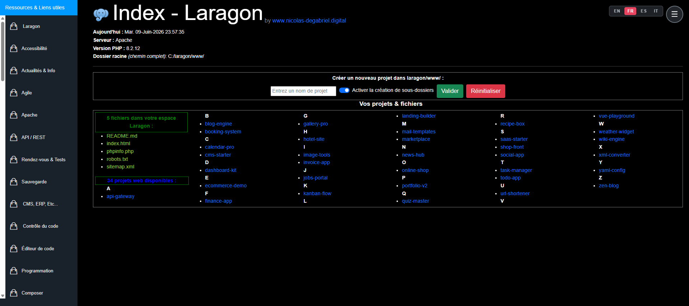

# INDEX_LARAGON



**Langues · Languages · Idiomas · Lingue · Sprachen :**
🇫🇷 [Français](#français) · 🇬🇧 [English](#english) · 🇪🇸 [Español](#español) · 🇮🇹 [Italiano](#italiano) · 🇩🇪 [Deutsch](#deutsch)

---

## Français

Tableau de bord d'accueil pour le dossier `www/` d'un serveur local (Laragon, théoriquement compatible WAMP / MAMP / XAMPP). Il remplace la page d'index par défaut par un tableau de bord pratique pour le développement.

> Accès **localhost uniquement** : toute requête provenant d'une autre IP reçoit une fausse page 404 et est journalisée.

### Fonctionnalités

- 📂 **Listing** des sites et fichiers présents dans `www/` (tri alphabétique, regroupement par lettre).
- 🧭 **Menu latéral** de liens utiles au développement, classés par catégorie (Git, Docker, SEO, IA, bases de données, sécurité…).
- ➕ **Création rapide de projet** (avec structure de dossiers optionnelle).
- 🛠️ **Outil intégré** : Adminer (gestion des bases MySQL).
- 📮 **Mailpit** : raccourci vers l'attrape-emails de dev local (SMTP `localhost:1025`, interface `localhost:8025`), avec indicateur d'état actif/arrêté dans le menu.
- 🌍 **Multilingue** : FR / EN / ES / IT / DE.
- ♿ **Accessibilité réglable** : thème clair/sombre, taille du texte, contraste élevé, police dyslexie, modes daltonisme, réduction des animations.
- 🎛️ **Menu personnalisable** : activer/désactiver le menu, choisir les catégories affichées.
- ✏️ **Éditeur de menu** intégré : ajouter, modifier, réordonner catégories et liens (enregistré en local).
- 🔔 **Bandeau de mise à jour** : vérifie la dernière version publiée sur GitHub.
- 🔒 **Sécurité** : restriction localhost, protection CSRF, journalisation des accès et intrusions.

### Stack

- PHP 8.0+ (procédural, sans framework, sans dépendance)
- Bootstrap 5 + jQuery 3.6 (embarqués)
- Stockage en fichiers plats (logs), pas de base de données

### Installation

1. Cloner ce dépôt dans `www/INDEX_LARAGON/` :

   ```bash
   cd c:/laragon/www
   git clone <url> INDEX_LARAGON
   ```

2. **Copier le contenu de [`install/www-root/`](install/www-root/) à la racine de `www/`** : `index.php` (remplace celui par défaut) et, en option, `.htaccess` (restriction réseau).

3. Ouvrir `http://localhost/`.

### Sécurité & vie privée

- Les logs (`LOG/*.log`) contiennent des adresses IP et **ne sont pas versionnés**.
- Le `.htaccess` optionnel (voir l'[Annexe](#annexe--appendix--anexo--appendice)) restreint tout `www/` au localhost.

---

## English

Home dashboard for the `www/` folder of a local server (Laragon, theoretically compatible with WAMP / MAMP / XAMPP). It replaces the default index page with a handy dashboard for development.

> **Localhost only**: any request from another IP gets a fake 404 page and is logged.

### Features

- 📂 **Listing** of the sites and files in `www/` (alphabetical, grouped by letter).
- 🧭 **Side menu** of useful dev links, sorted by category (Git, Docker, SEO, AI, databases, security…).
- ➕ **Quick project creation** (with an optional folder structure).
- 🛠️ **Built-in tool**: Adminer (MySQL database management).
- 📮 **Mailpit**: shortcut to the local dev-email catcher (SMTP `localhost:1025`, UI `localhost:8025`), with a live active/stopped status in the menu.
- 🌍 **Multilingual**: FR / EN / ES / IT / DE.
- ♿ **Adjustable accessibility**: light/dark theme, text size, high contrast, dyslexia font, colour-blindness modes, reduced motion.
- 🎛️ **Customizable menu**: enable/disable the menu, choose which categories show.
- ✏️ **Built-in menu editor**: add, edit and reorder categories and links (saved locally).
- 🔔 **Update banner**: checks the latest version released on GitHub.
- 🔒 **Security**: localhost restriction, CSRF protection, access/intrusion logging.

### Stack

- PHP 8.0+ (procedural, no framework, no dependency)
- Bootstrap 5 + jQuery 3.6 (bundled)
- Flat-file storage (logs), no database

### Installation

1. Clone this repo into `www/INDEX_LARAGON/`:

   ```bash
   cd c:/laragon/www
   git clone <url> INDEX_LARAGON
   ```

2. **Copy the contents of [`install/www-root/`](install/www-root/) to the `www/` root**: `index.php` (replaces the default one) and, optionally, `.htaccess` (network restriction).

3. Open `http://localhost/`.

### Security & privacy

- Logs (`LOG/*.log`) contain IP addresses and are **not versioned**.
- The optional `.htaccess` (see the [Appendix](#annexe--appendix--anexo--appendice)) restricts all of `www/` to localhost.

---

## Español

Panel de inicio para la carpeta `www/` de un servidor local (Laragon, teóricamente compatible con WAMP / MAMP / XAMPP). Reemplaza la página de índice por defecto por un panel práctico para el desarrollo.

> Acceso **solo localhost**: cualquier petición desde otra IP recibe una página 404 falsa y queda registrada.

### Funcionalidades

- 📂 **Listado** de los sitios y archivos de `www/` (alfabético, agrupado por letra).
- 🧭 **Menú lateral** de enlaces útiles para el desarrollo, por categoría (Git, Docker, SEO, IA, bases de datos, seguridad…).
- ➕ **Creación rápida de proyectos** (con estructura de carpetas opcional).
- 🛠️ **Herramienta integrada**: Adminer (gestión de bases MySQL).
- 📮 **Mailpit**: acceso al capturador de correos de desarrollo local (SMTP `localhost:1025`, interfaz `localhost:8025`), con indicador de estado activo/detenido en el menú.
- 🌍 **Multilingüe**: FR / EN / ES / IT / DE.
- ♿ **Accesibilidad ajustable**: tema claro/oscuro, tamaño del texto, alto contraste, fuente para dislexia, modos de daltonismo, reducción de animaciones.
- 🎛️ **Menú personalizable**: activar/desactivar el menú, elegir las categorías mostradas.
- ✏️ **Editor de menú** integrado: añadir, editar y reordenar categorías y enlaces (guardado en local).
- 🔔 **Aviso de actualización**: comprueba la última versión publicada en GitHub.
- 🔒 **Seguridad**: restricción a localhost, protección CSRF, registro de accesos e intentos.

### Stack

- PHP 8.0+ (procedural, sin framework, sin dependencias)
- Bootstrap 5 + jQuery 3.6 (incluidos)
- Almacenamiento en archivos planos (logs), sin base de datos

### Instalación

1. Clonar este repositorio en `www/INDEX_LARAGON/`:

   ```bash
   cd c:/laragon/www
   git clone <url> INDEX_LARAGON
   ```

2. **Copiar el contenido de [`install/www-root/`](install/www-root/) a la raíz de `www/`**: `index.php` (reemplaza el predeterminado) y, opcionalmente, `.htaccess` (restricción de red).

3. Abrir `http://localhost/`.

### Seguridad y privacidad

- Los logs (`LOG/*.log`) contienen direcciones IP y **no se versionan**.
- El `.htaccess` opcional (ver el [Apéndice](#annexe--appendix--anexo--appendice)) restringe todo `www/` a localhost.

---

## Italiano

Dashboard iniziale per la cartella `www/` di un server locale (Laragon, teoricamente compatibile con WAMP / MAMP / XAMPP). Sostituisce la pagina index predefinita con una dashboard pratica per lo sviluppo.

> Accesso **solo localhost**: ogni richiesta da un altro IP riceve una falsa pagina 404 e viene registrata.

### Funzionalità

- 📂 **Elenco** dei siti e file presenti in `www/` (alfabetico, raggruppato per lettera).
- 🧭 **Menu laterale** di link utili allo sviluppo, per categoria (Git, Docker, SEO, IA, database, sicurezza…).
- ➕ **Creazione rapida di progetti** (con struttura di cartelle opzionale).
- 🛠️ **Strumento integrato**: Adminer (gestione database MySQL).
- 📮 **Mailpit**: scorciatoia al catcher di email di sviluppo locale (SMTP `localhost:1025`, interfaccia `localhost:8025`), con indicatore di stato attivo/fermo nel menu.
- 🌍 **Multilingue**: FR / EN / ES / IT / DE.
- ♿ **Accessibilità regolabile**: tema chiaro/scuro, dimensione del testo, alto contrasto, font dislessia, modalità daltonismo, riduzione delle animazioni.
- 🎛️ **Menu personalizzabile**: attiva/disattiva il menu, scegli le categorie mostrate.
- ✏️ **Editor del menu** integrato: aggiungere, modificare e riordinare categorie e link (salvato in locale).
- 🔔 **Banner di aggiornamento**: controlla l'ultima versione pubblicata su GitHub.
- 🔒 **Sicurezza**: restrizione a localhost, protezione CSRF, registrazione di accessi e tentativi.

### Stack

- PHP 8.0+ (procedurale, senza framework, senza dipendenze)
- Bootstrap 5 + jQuery 3.6 (inclusi)
- Archiviazione su file piatti (log), nessun database

### Installazione

1. Clonare questo repository in `www/INDEX_LARAGON/`:

   ```bash
   cd c:/laragon/www
   git clone <url> INDEX_LARAGON
   ```

2. **Copiare il contenuto di [`install/www-root/`](install/www-root/) nella radice di `www/`**: `index.php` (sostituisce quello predefinito) e, facoltativamente, `.htaccess` (restrizione di rete).

3. Aprire `http://localhost/`.

### Sicurezza e privacy

- I log (`LOG/*.log`) contengono indirizzi IP e **non sono versionati**.
- Il `.htaccess` opzionale (vedi l'[Appendice](#annexe--appendix--anexo--appendice)) limita tutto `www/` a localhost.

---

## Deutsch

Start-Dashboard für den `www/`-Ordner eines lokalen Servers (Laragon, theoretisch kompatibel mit WAMP / MAMP / XAMPP). Es ersetzt die Standard-Indexseite durch ein praktisches Dashboard für die Entwicklung.

> **Nur localhost**: Jede Anfrage von einer anderen IP erhält eine gefälschte 404-Seite und wird protokolliert.

### Funktionen

- 📂 **Auflistung** der Websites und Dateien in `www/` (alphabetisch, nach Buchstaben gruppiert).
- 🧭 **Seitenmenü** mit nützlichen Dev-Links, nach Kategorie sortiert (Git, Docker, SEO, KI, Datenbanken, Sicherheit…).
- ➕ **Schnelle Projekterstellung** (mit optionaler Ordnerstruktur).
- 🛠️ **Integriertes Tool**: Adminer (MySQL-Datenbankverwaltung).
- 📮 **Mailpit**: Verknüpfung zum lokalen Dev-E-Mail-Catcher (SMTP `localhost:1025`, Oberfläche `localhost:8025`), mit Live-Status aktiv/gestoppt im Menü.
- 🌍 **Mehrsprachig**: FR / EN / ES / IT / DE.
- ♿ **Anpassbare Barrierefreiheit**: helles/dunkles Theme, Textgröße, hoher Kontrast, Legasthenie-Schriftart, Farbenblindheits-Modi, reduzierte Animationen.
- 🎛️ **Anpassbares Menü**: Menü aktivieren/deaktivieren, angezeigte Kategorien wählen.
- ✏️ **Integrierter Menü-Editor**: Kategorien und Links hinzufügen, bearbeiten und neu anordnen (lokal gespeichert).
- 🔔 **Update-Banner**: prüft die neueste auf GitHub veröffentlichte Version.
- 🔒 **Sicherheit**: localhost-Beschränkung, CSRF-Schutz, Protokollierung von Zugriffen und Eindringversuchen.

### Stack

- PHP 8.0+ (prozedural, ohne Framework, ohne Abhängigkeiten)
- Bootstrap 5 + jQuery 3.6 (mitgeliefert)
- Speicherung in Flat Files (Logs), keine Datenbank

### Installation

1. Dieses Repository nach `www/INDEX_LARAGON/` klonen:

   ```bash
   cd c:/laragon/www
   git clone <url> INDEX_LARAGON
   ```

2. **Den Inhalt von [`install/www-root/`](install/www-root/) in das `www/`-Stammverzeichnis kopieren**: `index.php` (ersetzt die Standarddatei) und optional `.htaccess` (Netzwerkbeschränkung).

3. `http://localhost/` öffnen.

### Sicherheit & Datenschutz

- Die Logs (`LOG/*.log`) enthalten IP-Adressen und werden **nicht versioniert**.
- Die optionale `.htaccess` (siehe [Anhang](#annexe--appendix--anexo--appendice)) beschränkt das gesamte `www/` auf localhost.

---

## Annexe · Appendix · Anexo · Appendice

### Fichiers `www/` fournis · Provided `www/` files

Les fichiers à placer à la racine de `www/` sont fournis dans [`install/www-root/`](install/www-root/) · *The files to place at the `www/` root are provided in [`install/www-root/`](install/www-root/):*

- **`index.php`** — point d'entrée (obligatoire) · *entry point (required)*
- **`.htaccess`** — restreint tout `www/` au localhost (réseau = 403) + force HTTPS (recommandé) · *restricts all of `www/` to localhost (network = 403), forces HTTPS (recommended)*

### Mailpit — emails de dev · dev email (optionnel · optional)

Mailpit **n'est pas embarqué** dans ce dépôt : c'est un outil local séparé qui capture les emails de dev (SMTP `localhost:1025`, interface `http://localhost:8025`). Le dashboard ne fait que **pointer vers son interface** et afficher son état. · *Mailpit is **not bundled** in this repo: it is a separate local tool that catches dev emails (SMTP `localhost:1025`, UI `http://localhost:8025`). The dashboard only **links to its UI** and shows its status.*

- **Site officiel · Official site** : <https://mailpit.axllent.org> — dépôt · repo : <https://github.com/axllent/mailpit>
- **Laragon** : souvent déjà fourni dans `C:\laragon\bin\mailpit\mailpit.exe`. Pour le garder actif en permanence · *often already provided at `C:\laragon\bin\mailpit\mailpit.exe`. To keep it running* :

  ```bash
  pm2 start C:\laragon\bin\mailpit\mailpit.exe --name mailpit
  pm2 save
  ```

- **WAMP / MAMP / XAMPP / autre · other** : télécharger le binaire depuis le site officiel puis le lancer (il écoute alors SMTP `1025` / UI `8025`). · *download the binary from the official site and run it (it then listens on SMTP `1025` / UI `8025`).*
- **Côté application · App side** : router le SMTP de dev vers `127.0.0.1:1025`. · *point your dev SMTP to `127.0.0.1:1025`.*

### Structure (`INDEX_LARAGON/`)

```text
index.php          Point d'entrée / Entry point
security.php       Garde localhost + journalisation / localhost guard + logging
Partials/          Fragments de vue / View fragments
                   (Head, Header, Create_Folder, Modals, Scripts)
Lang/              i18n (en, fr, es, it)
Menu/              Sidebar + sous-menus / submenus
Tools/             Adminer
Assets/            Bootstrap, jQuery, CSS, images
install/www-root/  Fichiers à copier à la racine de www/ / Files to copy to the www/ root
```

---

## Licence · License · Licencia · Licenza · Lizenz

[MIT](LICENSE) — © Nicolas Degabriel — [nicolas-degabriel.digital](https://nicolas-degabriel.digital)

> Traductions (FR / ES / IT / DE), à titre informatif : [LICENSE-translations.md](LICENSE-translations.md). Seule la version anglaise dans [LICENSE](LICENSE) fait foi.
